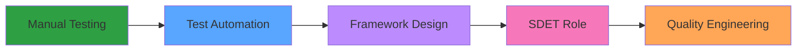

<div align="center">

# Hi there, I'm Md Yusuf Ahmed 👋

### Software Quality Assurance Engineer | Automation & SDET Aspirant

[](<div align="center">

# Hi there, I'm Md Yusuf Ahmed 👋

### Software Quality Assurance Engineer | Automation & SDET Aspirant

[](https://linkedin.com/in/your-profile)
[](mailto:yusufahmed.sdet@gmail.com )
[](https://drive.google.com/drive/folders/1nMXd2lvetw6VoKCxuPChPVGHr9zdsMo6)

</div>

---

## 🚀 About Me
```yaml
name: Md Yusuf Ahmed
role: SQA Engineer @ SDS Managed
experience: ~2 years in Manual, Automation & API Testing
focus: Test Automation Frameworks & Scalable QA Practices
goal: Transitioning to SDET / Full-Stack QA
interests: 
  - Building robust automation frameworks
  - Quality engineering best practices
  - Continuous testing & CI/CD integration
```

- 🔬 Passionate about **quality-first engineering** and **shift-left testing**
- 🤖 Building **maintainable, scalable test automation** solutions
- 🌱 Currently deepening expertise in **advanced automation patterns** and **performance testing**
- 💡 Open to collaborating on **automation frameworks, test utilities & QA tooling**

---

## 🛠️ Tech Stack

<div align="center">

### Testing & Automation


### Languages & Databases


### DevOps & Tools


</div>

---

## 💼 What I Do

<table>
<tr>
<td width="50%">

### 🏗️ Framework Development
- Design & implement **Page Object Model (POM)** frameworks
- Create reusable test components and utilities
- Establish coding standards and best practices

</td>
<td width="50%">

### 🧪 Test Automation
- Write **reliable, maintainable test suites**
- End-to-end, API, and integration testing
- Cross-browser & cross-platform validation

</td>
</tr>
<tr>
<td width="50%">

### 📊 Quality Assurance
- Improve test coverage & release confidence
- Performance and load testing
- Defect tracking and root cause analysis

</td>
<td width="50%">

### 🔄 CI/CD Integration
- Automate test execution in pipelines
- Generate comprehensive test reports
- Enable continuous testing workflows

</td>
</tr>
</table>

---

## 📊 GitHub Stats

<div align="center">


</div>

---

## 🎯 Current Focus


---

## 🏆 Achievements & Milestones

<div align="center">

| 📈 Metric | 🎯 Achievement |
|-----------|----------------|
| **Years of Experience** | ~2 Years in QA |
| **Testing Domains** | Web, API, Mobile, Performance |
| **Frameworks Built** | Multiple POM-based suites |
| **Test Cases Automated** | 500+ |
| **Tools Mastered** | 10+ Testing Tools |

</div>

---

## 📫 Let's Connect

<div align="center">

I'm always open to discussing **QA strategies**, **automation challenges**, and **quality engineering practices**!

📧 **Email:** your.email@example.com  
💼 **LinkedIn:** [Connect with me](https://linkedin.com/in/your-profile)  
📄 **Resume:** [View my detailed resume](https://drive.google.com/drive/folders/1nMXd2lvetw6VoKCxuPChPVGHr9zdsMo6)

---

**⭐ Focused on quality, automation, and continuous improvement**

*"Quality is not an act, it is a habit." - Aristotle*

</div>)
[](mailto:your.email@example.com)
[](https://drive.google.com/drive/folders/1nMXd2lvetw6VoKCxuPChPVGHr9zdsMo6)

</div>

---

## 🚀 About Me
```yaml
name: Md Yusuf Ahmed
role: SQA Engineer @ SDS Managed
experience: ~2 years in Manual, Automation & API Testing
focus: Test Automation Frameworks & Scalable QA Practices
goal: Transitioning to SDET / Full-Stack QA
interests: 
  - Building robust automation frameworks
  - Quality engineering best practices
  - Continuous testing & CI/CD integration
```

- 🔬 Passionate about **quality-first engineering** and **shift-left testing**
- 🤖 Building **maintainable, scalable test automation** solutions
- 🌱 Currently deepening expertise in **advanced automation patterns** and **performance testing**
- 💡 Open to collaborating on **automation frameworks, test utilities & QA tooling**

---

## 🛠️ Tech Stack

<div align="center">

### Testing & Automation


### Languages & Databases


### DevOps & Tools


</div>

---

## 💼 What I Do

<table>
<tr>
<td width="50%">

### 🏗️ Framework Development
- Design & implement **Page Object Model (POM)** frameworks
- Create reusable test components and utilities
- Establish coding standards and best practices

</td>
<td width="50%">

### 🧪 Test Automation
- Write **reliable, maintainable test suites**
- End-to-end, API, and integration testing
- Cross-browser & cross-platform validation

</td>
</tr>
<tr>
<td width="50%">

### 📊 Quality Assurance
- Improve test coverage & release confidence
- Performance and load testing
- Defect tracking and root cause analysis

</td>
<td width="50%">

### 🔄 CI/CD Integration
- Automate test execution in pipelines
- Generate comprehensive test reports
- Enable continuous testing workflows

</td>
</tr>
</table>

---

## 📊 GitHub Stats

<div align="center">


</div>

---

## 🎯 Current Focus


---

## 🏆 Achievements & Milestones

<div align="center">

| 📈 Metric | 🎯 Achievement |
|-----------|----------------|
| **Years of Experience** | ~2 Years in QA |
| **Testing Domains** | Web, API, Mobile, Performance |
| **Frameworks Built** | Multiple POM-based suites |
| **Test Cases Automated** | 500+ |
| **Tools Mastered** | 10+ Testing Tools |

</div>

---

## 📫 Let's Connect

<div align="center">

I'm always open to discussing **QA strategies**, **automation challenges**, and **quality engineering practices**!

📧 **Email:** your.email@example.com  
💼 **LinkedIn:** [Connect with me](<div align="center">

# Hi there, I'm Md Yusuf Ahmed 👋

### Software Quality Assurance Engineer | Automation & SDET Aspirant

[](https://linkedin.com/in/your-profile)
[](mailto:your.email@example.com)
[](https://drive.google.com/drive/folders/1nMXd2lvetw6VoKCxuPChPVGHr9zdsMo6)

</div>

---

## 🚀 About Me
```yaml
name: Md Yusuf Ahmed
role: SQA Engineer @ SDS Managed
experience: ~2 years in Manual, Automation & API Testing
focus: Test Automation Frameworks & Scalable QA Practices
goal: Transitioning to SDET / Full-Stack QA
interests: 
  - Building robust automation frameworks
  - Quality engineering best practices
  - Continuous testing & CI/CD integration
```

- 🔬 Passionate about **quality-first engineering** and **shift-left testing**
- 🤖 Building **maintainable, scalable test automation** solutions
- 🌱 Currently deepening expertise in **advanced automation patterns** and **performance testing**
- 💡 Open to collaborating on **automation frameworks, test utilities & QA tooling**

---

## 🛠️ Tech Stack

<div align="center">

### Testing & Automation


### Languages & Databases


### DevOps & Tools


</div>

---

## 💼 What I Do

<table>
<tr>
<td width="50%">

### 🏗️ Framework Development
- Design & implement **Page Object Model (POM)** frameworks
- Create reusable test components and utilities
- Establish coding standards and best practices

</td>
<td width="50%">

### 🧪 Test Automation
- Write **reliable, maintainable test suites**
- End-to-end, API, and integration testing
- Cross-browser & cross-platform validation

</td>
</tr>
<tr>
<td width="50%">

### 📊 Quality Assurance
- Improve test coverage & release confidence
- Performance and load testing
- Defect tracking and root cause analysis

</td>
<td width="50%">

### 🔄 CI/CD Integration
- Automate test execution in pipelines
- Generate comprehensive test reports
- Enable continuous testing workflows

</td>
</tr>
</table>

---

## 📊 GitHub Stats

<div align="center">


</div>

---

## 🎯 Current Focus


---

## 🏆 Achievements & Milestones

<div align="center">

| 📈 Metric | 🎯 Achievement |
|-----------|----------------|
| **Years of Experience** | ~2 Years in QA |
| **Testing Domains** | Web, API, Mobile, Performance |
| **Frameworks Built** | Multiple POM-based suites |
| **Test Cases Automated** | 500+ |
| **Tools Mastered** | 10+ Testing Tools |

</div>

---

## 📫 Let's Connect

<div align="center">

I'm always open to discussing **QA strategies**, **automation challenges**, and **quality engineering practices**!

📧 **Email:** yusufahmed.sdet@gmail.com 
💼 **LinkedIn:** [Connect with me](https://linkedin.com/in/your-profile)  
📄 **Resume:** [View my detailed resume](https://drive.google.com/drive/folders/1nMXd2lvetw6VoKCxuPChPVGHr9zdsMo6)

---

**⭐ Focused on quality, automation, and continuous improvement**

*"Quality is not an act, it is a habit." - Aristotle*

</div>)  
📄 **Resume:** [View my detailed resume](https://drive.google.com/drive/folders/1nMXd2lvetw6VoKCxuPChPVGHr9zdsMo6)

---

**⭐ Focused on quality, automation, and continuous improvement**

*"Quality is not an act, it is a habit." - Aristotle*

</div>
